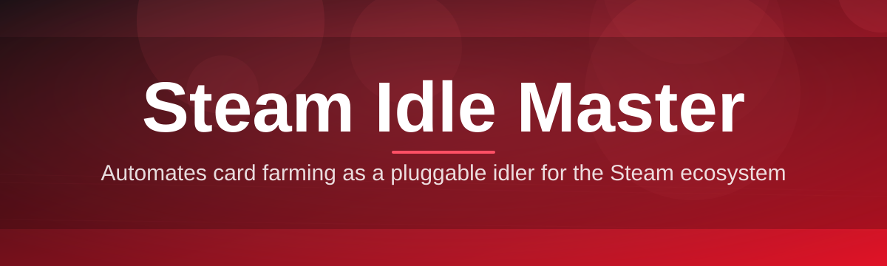
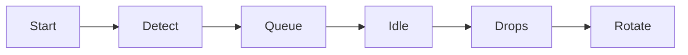

# steam-idle-master-controller 🎮✨

  

*Let your library farm trading cards while you actually live your life.*

  

## 📖 The Origin Story

Back in the early days of Steam trading cards, idling games meant babysitting a dozen browser tabs, or worse, keeping a rat's nest of shortcut files open on your taskbar just hoping nothing crashed overnight. Card drops were — and still are — capped per title, tied to playtime, and completely invisible unless you go digging through inventory pages. Somewhere between the fifth accidental game-launch and the third time Steam decided to "helpfully" close a background process, the idea for **steam-idle-master-controller** was born: one clean dashboard, zero babysitting.

This project exists because idling shouldn't feel like a part-time job. Whether you're a card-flipping trader chasing badge completion, a collector hoarding emoticons and profile backgrounds, or just someone who likes watching a progress bar creep toward 100%, this controller gives you a single pane of glass over every appID you own. No sketchy background daemons, no telemetry, no nonsense — just a lightweight Windows companion that talks to Steam the way Steam expects to be talked to.

Today, the tool has grown from a weekend script into a full controller with queueing, scheduling, and live drop tracking. It's built for people who understand that **Steam Idle Master**-style card farming is a numbers game, and numbers games deserve good tooling.

## 🚀 The Landing Pad

> [!TIP]
> Bookmark the landing page above — that's the single source of truth for builds, changelogs, and release notes. We never post binaries directly in this README.

---

## ⚡ Quick Start (before you read another word)

1. **Visit** the landing page via the download button above.

2. **Download** the latest standalone `.exe` — no installer wizard, no admin rights required.

3. **Run it, sign in with Steam, and hit "Start Idling."** Your card queue populates automatically.

That's it. Everything below is just the deep dive for when curiosity strikes. ☕

---

## 🧩 What Makes It Tick

1. **Multi-App Idle Queue** — Feed it your entire library or a curated list of appIDs, and it rotates through them intelligently, respecting per-title drop caps so no idle hour goes to waste.

2. **Live Drop Telemetry** — A real-time panel shows estimated remaining card drops per game, pulled straight from your inventory and playtime data, so you're never idling blind.

3. **Smart Scheduling** — Set idle windows (overnight, work hours, whatever) and let the controller pause and resume itself without you touching a thing.

4. **Featherweight Footprint** — Runs comfortably in the system tray with minimal CPU and RAM usage — your PC won't know it's there until the card count ticks up.

5. **Auto-Reconnect Logic** — Steam hiccups, network drops, sleep/wake cycles — the controller detects disconnects and silently resumes the queue.

6. **Badge Progress Tracker** — See exactly how many cards stand between you and that next badge level, sorted by "closest to completion" so you can prioritize efficiently.

7. **Session Logs & History** — Every idle session is logged locally with timestamps and drop counts, exportable as a plain CSV for the spreadsheet nerds among us.

8. **Dark & Light Themes** — Because idle dashboards should look good at 2 AM and at noon.

9. **Zero Dependency Install** — No Python runtime, no .NET redistributables to hunt down — the executable is fully self-contained.

10. **Portable Mode** — Drop it on a USB stick, run it on any Windows box, and it leaves nothing behind when you're done.

## 🖥️ System Requirements

| Component | Minimum |
|---|---|
| OS | Windows 10 (64-bit) or Windows 11 |
| RAM | 200 MB free (it's genuinely light) |
| Disk | ~40 MB, standalone executable |
| Network | Active internet connection for Steam session |
| Dependencies | None — fully self-contained binary |

> [!NOTE]
> There is no macOS or Linux build. The controller talks directly to the Windows-native Steam client process, which is why it's Windows-only by design, not by neglect.

## ⚙️ How It Works

The flow is intentionally simple — complexity lives under the hood, not in your face:

1. The controller detects your local Steam client and reads your owned appIDs.

2. It builds an idle queue, checking each title's remaining card-drop eligibility.

3. One (or several, depending on your settings) lightweight idle sessions are launched per title.

4. Drop progress is polled periodically and reflected live in the dashboard.

5. Once a title's drops are exhausted, it's rotated out and the next queued game steps in.

> [!IMPORTANT]
> The controller respects Steam's own drop-rate limits — it does not attempt to speed up, duplicate, or manipulate card drops. It simply automates the waiting part.

## 🧰 Troubleshooting Corner

**Q: My card drops aren't updating in real time — is something broken?**
A: Steam's own backend can lag on inventory refreshes. Give it 5–10 minutes; the controller polls periodically rather than instantly to avoid rate-limiting your account.

**Q: The app says "Steam client not detected."**
A: Make sure the actual Steam desktop client is open and you're logged in before launching the controller — it piggybacks on an active Steam session.

**Q: Can I idle more games than my queue shows?**
A: Yes, adjust the concurrency setting in Preferences — just know that idling too many titles at once can look unusual to Steam's systems, so moderation is smart.

**Q: Windows Defender flagged the executable.**
A: This happens with many small, unsigned open-source tools. Check the SHA256 checksum published on the landing page against your download to verify integrity.

**Q: Does this work with family-shared libraries?**
A: Partially — shared titles often have restricted card drops set by Valve, so results vary per game.

**Q: My idle session paused itself overnight.**
A: That's the Smart Scheduling feature respecting your configured idle window, not a bug. Check Settings → Schedule.

## 🎨 Interface & Experience

<strong>Keyboard shortcuts</strong> (click to expand)

| Shortcut | Action |
|---|---|
| `Ctrl + Q` | Toggle idle queue on/off |
| `Ctrl + Shift + L` | Open session logs |
| `Ctrl + ,` | Open Settings |
| `Ctrl + D` | Switch Dark/Light theme |
| `F5` | Force-refresh drop data |

- Fully resizable dashboard with a compact "mini mode" for docking to a corner.
- Theme presets: Midnight, Slate, and a high-contrast Daylight mode.
- Notification toggles for "drop received," "queue rotated," and "session paused."
- Configurable idle concurrency (1–10 simultaneous titles).

> [!WARNING]
> Running an extremely high concurrency count on low-end machines can cause Steam's own client to become sluggish — this is a Steam limitation, not a controller bug.

## 🤝 Contributing & Community

We're a community-driven project and genuinely welcome pull requests, issue reports, and feature ideas.

1. Fork the repository and create a feature branch.

2. Keep changes focused — one feature or fix per pull request makes review painless.

3. Open a PR with a clear description of what changed and why.

4. Join discussions in the Issues tab — good ideas often start as a simple question.

> [!TIP]
> First-time contributor? Look for issues tagged `good-first-issue` — they're scoped specifically to be approachable.

  

---

## 📜 License

Released under the [MIT License](LICENSE), 2026. Use it, fork it, remix it — just keep the license notice intact.

## ⚠️ Disclaimer

This project is an independent, community-built companion tool and is not affiliated with, endorsed by, or associated with Valve Corporation or Steam in any official capacity. It automates the idling process within Steam's own normal usage patterns and drop mechanics — it does not modify game files, alter account data, or interact with Valve's servers outside of standard client behavior. Use responsibly and in accordance with the Steam Subscriber Agreement.

---

